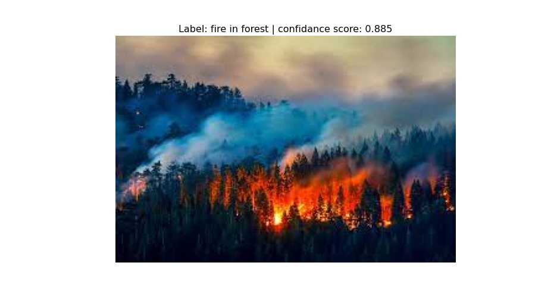
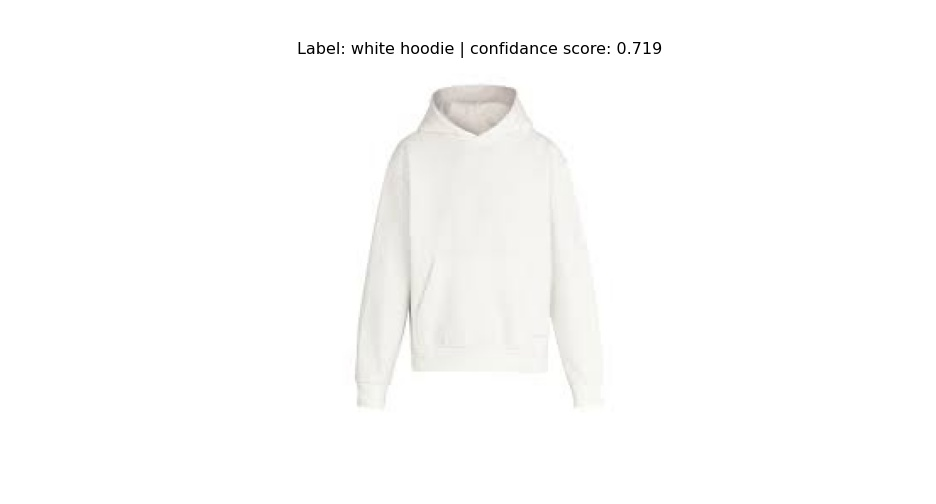
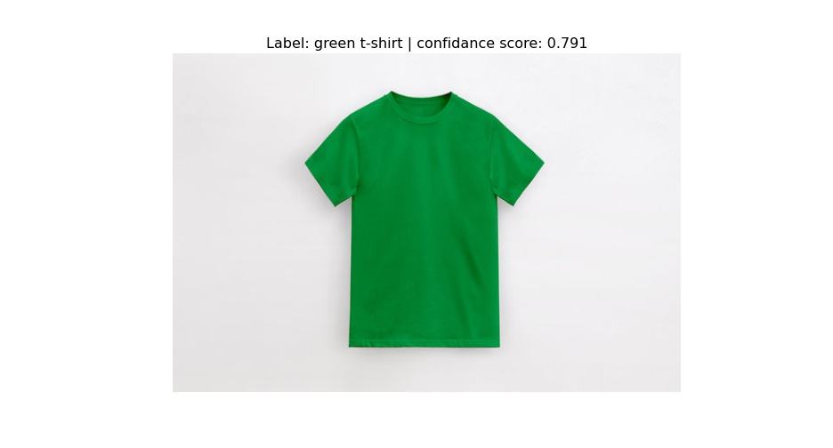
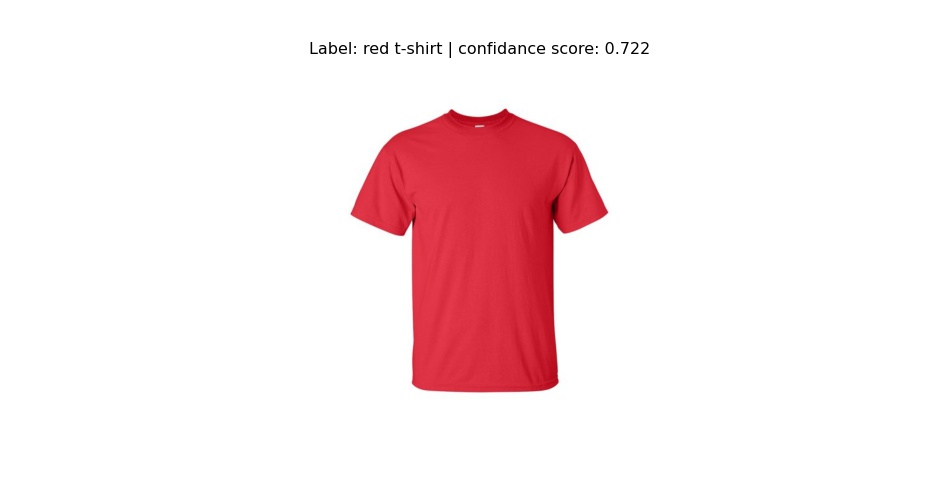
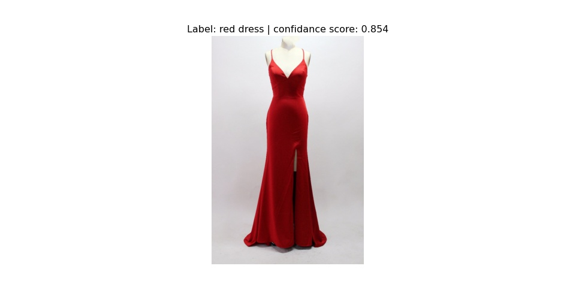
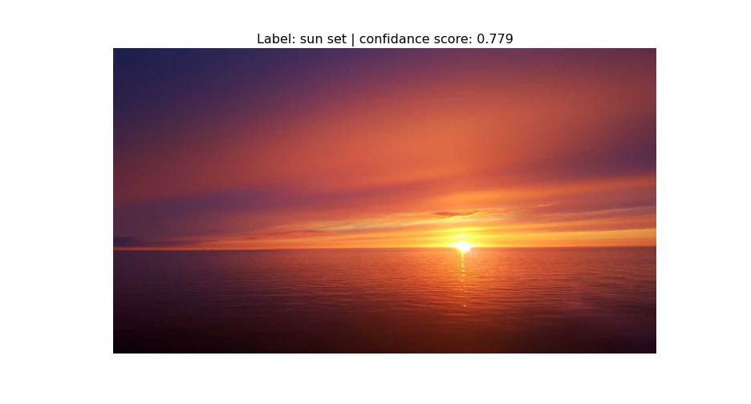
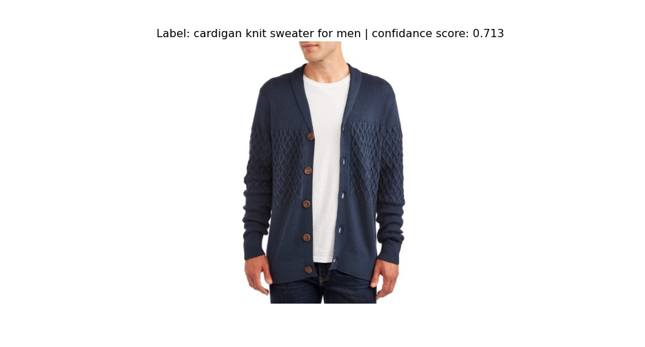
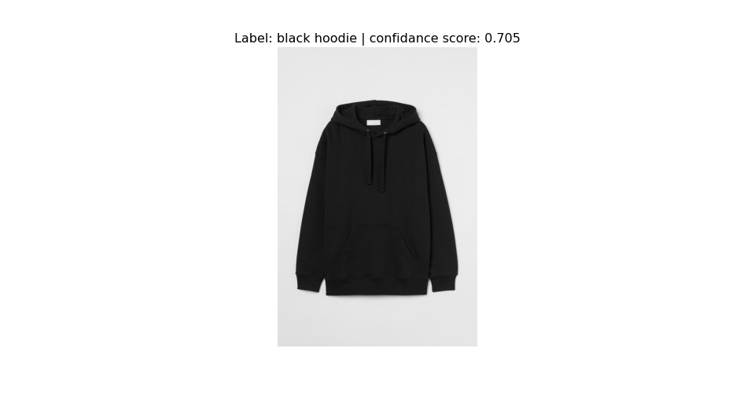
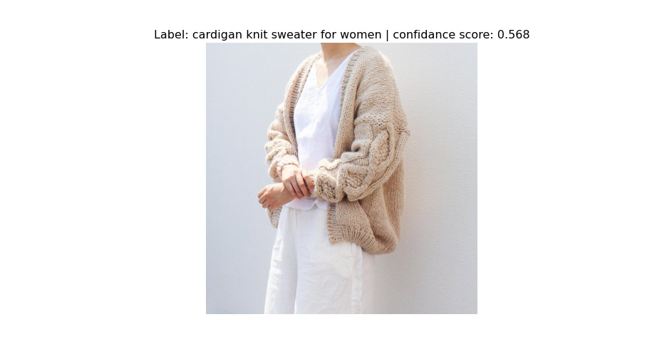

# Image-tagging

Image tagger algorithm that labels an input image with a word or text that
describes it the most from a predefined possible set of the text labels.

## Table of Contents

[Introduction](#introduction)

[How to Run](#howtorun)

[Resutls](#results)

[Further Work](#work)

<a name="introduction"></a>

# Introduction

This repo presents code of deep learning based algorithm for
**image tagging** task. The algorithm can label an input image with
corresponding text tag with high accuracy and efficiency. You just have to
provide a set of possible text tags and the algorithm will match an input image
with a corresponding tag. The text tag can be a single word or phrase, which you
should provide in `setting.yaml` file under `labels` key.

By default, the `Unknown` label will be returned if model's confidence is less
than `prediction-threshold` in `setting.yaml` file. You can check other possible
settings in the `setting.yaml` file.

<a name="howtorun"></a>

# How to Run

First install requirements:
`pip install -r requirements.txt -f https://download.pytorch.org/whl/torch_stable.html`

To test the model you can either run:
`python run.py --image-path ./data/0.jpg`

Or you can test it through web app:
`streamlit run app.py`

Or you can see the example code in `tutorial.ipynb` jupyter notebook

Or incorporate this model in your project using this code:

```python
import cv2

from model import Model

model = Model()
image = cv2.imread('./data/0.jpg')
image = cv2.cvtColor(image, cv2.COLOR_BGR2RGB)
best_match_label = model.predict(image=image)['labels'][0]
print('Image label is: ', best_match_label)
```

<a name="results"></a>

# Results

Below are the prediction results of the model. As you see the model accurately
labels images with tags from possible set of the text labels. You can find code
that produces that result in `tutorial.ipynb` jupyter notebook.

### Result Images











<a name="work"></a>

# Further Work

The further possible enhancements that can be done in the future are: batch
processing support for speedup in case of request with multiple images,
threshold fine-tuning for specific data, ect. 

# Author of the repo
Soso Sukhitashvili - [Linkedin](https://www.linkedin.com/in/soso-sukhitashvili/)

